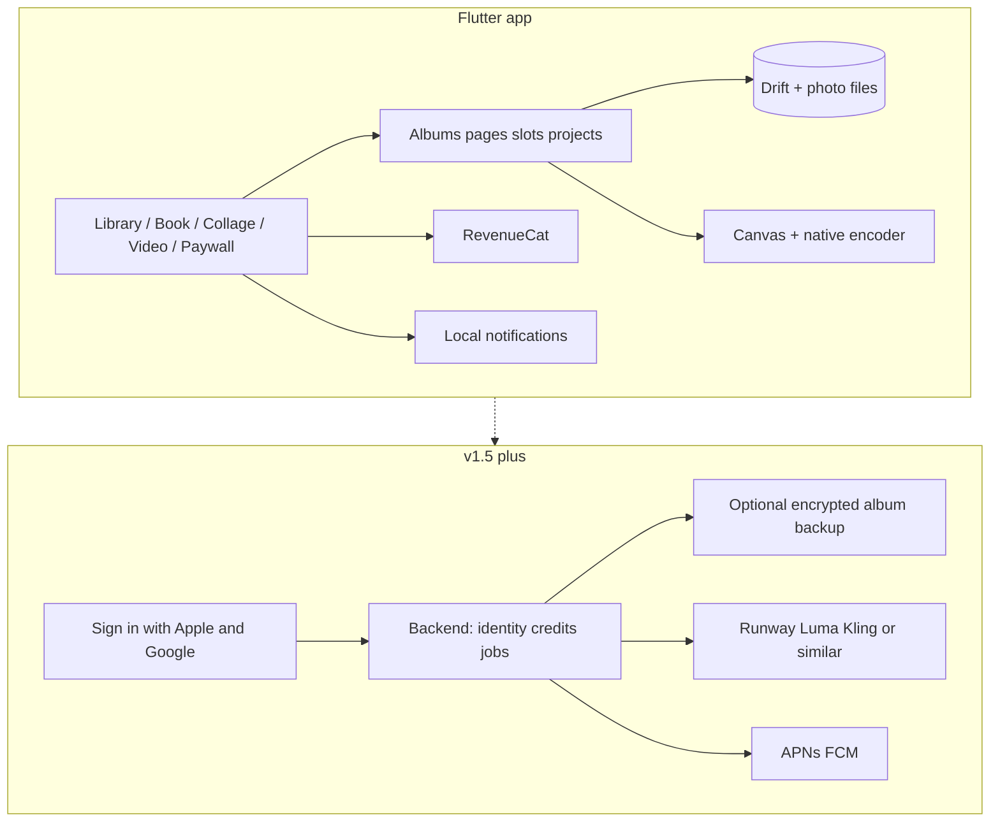
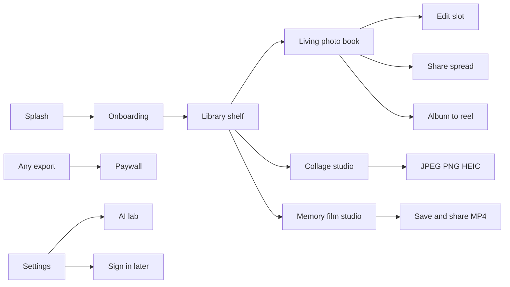
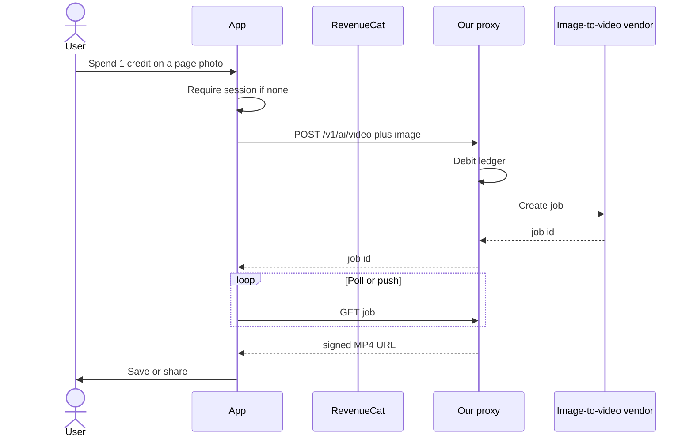

# Memory Book — System Design

**Status:** living document  
**Product:** Memory Book (`memory_book/`) — Flutter iOS + Android  
**Store framing:** Memory Book. iOS updates the live Memory Collage listing. Android is a new Play listing.  
**Principle:** a living photobook that also exports collages and reels. Photos stay on-device until the user exports, signs in, or spends an AI credit.

This document is the technical source of truth for what we have shipped and how we grow it into a world-class image + video memory app. Pair it with [PRODUCT_ROADMAP.md](PRODUCT_ROADMAP.md).

---

## 1. Product thesis (engineering implications)

Stores already have collage makers (Canva, Picsart) and editors (CapCut, InShot). The differentiator is **opening memories like a physical album**, then branching into still export, film, and (later) generative extras.

Implications:

- The page-turn and paper materials are core product, not chrome.
- Image/video pipelines must be **canvas-rendered and encoded**, never window screenshots.
- v1 is **local-first**. Accounts, cloud, and AI vendors are additive and optional.
- Never put vendor API keys in the client. AI always goes through our proxy.

---

## 2. Current vs target

| Layer | Today (v1 client) | Target (world-class) |
| --- | --- | --- |
| Client | Flutter 3, Riverpod, go_router, Drift | Same, plus crash/analytics, notification service, richer editors |
| Identity | None required | Sign in with Apple / Google only when cloud or AI wallet is needed |
| Entitlements | RevenueCat if keyed; else local unlock | RevenueCat only: premium + consumable AI credits |
| Photos | Copied into app sandbox; slot pan/zoom; date-range fill | Same + original asset IDs, limited-library handling, face-aware crop |
| Export stills | `PictureRecorder` → JPEG/PNG; HEIC via iOS channel | True HEIC Android where supported; 4K; stickers/fonts |
| Export video | Native H.264 (AVAssetWriter / MediaCodec) | Transitions, Ken Burns, beat-sync, HDR where device allows |
| AI | Client stub + credit ledger; on-device reel fallback | Backend proxy to image-to-video / enhance; no keys in app |
| Push | None | Local reminders + (after login) remote: export ready, credit, anniversary |
| Sync | Device-only | Optional encrypted cloud albums |

The Swift/iOS tree at the repo root is **reference only** (template math, filters, bundled scores). Do not port screenshot export or the old video god-view.

---

## 3. High-level architecture



### 3.1 Client stack (locked)

- **UI:** Flutter 3 / Dart 3, custom paper-and-film theme (`lib/core/theme`)
- **State:** Riverpod
- **Nav:** go_router (`/library`, `/book/:id`, `/collage`, `/video`, `/paywall`, `/settings`, `/ai`)
- **DB:** Drift (`lib/data/db/app_database.dart`)
- **Photos:** `photo_manager` + `image_picker`; copies persist under app documents
- **IAP:** `purchases_flutter` (RevenueCat). Empty `REVENUECAT_API_KEY` → local entitlement for development only
- **Share / save:** `share_plus`, `gal`
- **Video encode:** MethodChannel `memory_book/video_encoder` (not FFmpeg — avoids IPA/APK bloat)
- **Auth (scaffolded, not required):** Sign in with Apple, Google Sign-In
- **iOS plugins:** Swift Package Manager (CocoaPods deintegrated)

### 3.2 Backend (not required for v1)

When AI credits or cloud backup ship:

- **Auth:** Sign in with Apple + Google; RevenueCat `appUserID` = our user id after login
- **API:** thin proxy (Cloud Run / Supabase Edge / similar)
  - `POST /v1/ai/video` — image-to-video job
  - `GET /v1/ai/jobs/:id` — status + signed URL
  - `POST /v1/credits/grant` — webhook from RevenueCat
- **Ledger:** server is source of truth; client Drift `CreditEvents` is a cache
- **Secrets:** Runway/Luma/Kling keys only on the server
- **Storage:** optional encrypted object store for album packages (user opt-in)

---

## 4. App surfaces



| Surface | Responsibility |
| --- | --- |
| Shelf | Local albums as physical covers; create book |
| Book reader | Cover open, two-page spread, page-turn, slot edit |
| Collage studio | Templates, canvas render, watermark for free |
| Video studio | Slideshow/film: aspect, filter, transition, music |
| Paywall | Premium: no watermark, all templates, unlimited books, 4K |
| Settings | Premium, privacy, optional identity, AI credits |
| AI lab | Spend credit → proxy or on-device fallback |

---

## 5. Data model

### 5.1 Drift tables (now)

- **Albums** — title, `themeId`, cover path, date range
- **BookPages** — `albumId`, index, `layoutId`
- **PhotoSlots** — image path, caption, pan/zoom (`scale`, `offsetX/Y`), `filterId`, `showDate`
- **CollageProjects / CollageItems / CollageTexts**
- **VideoProjects / VideoClips**
- **AppKvEntries** — onboarding, local premium flag (dev only)
- **CreditEvents** — signed integer deltas (client cache)
- **AuthSessions** — provider, subject, email (empty until login)

Photos are **files**, not BLOBs. DB stores paths into `ApplicationDocuments/photos/`.

### 5.2 Target additions

- `originalAssetId` + `creationDate` on slots (library round-trip, auto-albums)
- `sticker` / `textStyle` on pages and collages
- `exportJobs` — local queue for long encodes + notification when done
- `remoteJobId` on AI jobs
- Soft-delete / trash for albums (30-day)

### 5.3 File layout (device)

```
Documents/
  photos/{uuid}.jpg          # persisted user media
  projects/{id}/             # optional project packages later
tmp/mb_export/               # stills and frame sequences
tmp/reel_{id}/               # flip-reel frames then deleted
```

Do **not** wipe the whole temp directory (bug in the old Swift video path).

---

## 6. Domain: images

### 6.1 Ingest

1. System picker or PhotoKit / Photo Picker (`photo_manager`)
2. Decode, downscale long edge (today 2400px), JPEG persist
3. Respect **limited library** (iOS) and Android Photo Picker partial access
4. Never require full-library access for “add one photo”

### 6.2 Editing (non-AI)

| Capability | v1 | Target |
| --- | --- | --- |
| Add / replace / delete in a slot | Yes | Yes |
| Pan / zoom crop in cell | Partial (stored offsets) | Interactive crop + face-aware default |
| Filters | ColorMatrix set | Same + film LUTs |
| Captions | Yes | Fonts, ink color, date sticker |
| Backgrounds | Solid | Paper textures, gradients, custom image |
| Stickers / washi / handwriting | No | Yes, premium pack |
| Adjust (light, contrast, crop, rotate, straighten) | No | Photo editor sheet |
| Heal / object remove | No | AI, credit or premium |

### 6.3 Collage

- Templates are **normalized 0–1 frames** (`lib/domain/collage_templates.dart`), ~30 curated (not empty NxN spam)
- Free vs premium IDs in `AppConfig.freeCollageTemplateIds` — gate in UI **and** export
- Render: `CollageRenderer` + `ui.PictureRecorder` at Low/Medium/High (720 / 1080 / 2160)
- Formats: JPEG, PNG, HEIC (iOS ImageIO; Android falls back to JPEG today)
- Free export draws watermark in pixel buffer, not as a view overlay someone can screenshot around easily (still not DRM)

### 6.4 Living photo book

- Cover themes: leather, linen, Polaroid, wedding, baby, travel
- Layouts: full, two, three, polaroid, scrapbook, blank
- Page-turn: perspective `Matrix4` + haptics (`PageCurlSpread`)
- Spread export: off-screen `BookPainter`
- Flip reel: paint cover + spreads + turn frames → native `encodeFrames` 1080×1920

Target feel: paper grain, foil titles, optional page-rustle, not a PDF pager.

---

## 7. Domain: video

### 7.1 Memory film (non-AI)

Inputs: ordered stills, aspect (`9:16` / `1:1` / `16:9`), seconds per still, filter, transition, optional audio.

Pipeline:

1. Flutter prepares image paths + music (bundled `assets/audio/1.mp3`–`11.mp3` materialized to tmp, or user file)
2. Channel `encodeSlideshow` / `encodeFrames`
3. **iOS:** `AVAssetWriter` H.264 + optional `AVMutableComposition` audio mix (`ios/Runner/AppDelegate.swift`)
4. **Android:** `MediaCodec` surface encoder + `MediaMuxer` (`MainActivity.kt`); audio mix is a follow-up
5. Preview `video_player` → `gal` save and/or `share_plus`

Transitions (Crossfade / Slide / Zoom) must be **encoded**, not UI-only. v1 channel currently holds frames; implement real ramps in the native encoder (roadmap).

### 7.2 Album → Reel

Ken Burns-ish stills of spreads + page-turn frames, 12 fps class, 9:16, share as Reels/TikTok/Shorts.

### 7.3 AI video (v1.5+)

Client never calls the model vendor.



If `AI_BASE_URL` is empty: refund the local credit and offer on-device Memory Reel (`AiVideoClient`).

Account is optional. Email registration uses Memory Book’s own Cognito app client (`COGNITO_CLIENT_ID`, `USER_PASSWORD_AUTH`), the same call shape as Arogya, never Arogya’s pool. The id token is sent as `Authorization: Bearer` on `/v1/ai/video`. With no client id, a local account still grants welcome credits so the credit path can be tested.

**Do not lead** with text-to-video. That is a different, expensive product. Our AI is in service of **their photos**.

---

## 8. Monetization (RevenueCat)

### 8.1 Products

| ID (intent) | Type | Unlocks |
| --- | --- | --- |
| `com.memorycollage.premium.annual` | Auto-renew | Unlimited books, no watermark, all templates, 4K, extra music, sticker packs |
| `com.memorycollage.premium.monthly` | Auto-renew | Same |
| `com.memorycollage.premium` | Legacy / lifetime if kept | Same |
| `com.memorycollage.credits.10` later | Consumable | AI jobs |

Entitlement: `premium`.

### 8.2 Client rules

- `PremiumService` reads RevenueCat `CustomerInfo` when API key is set
- **Never** treat “restore completed” as purchased without an active entitlement (bug in old `IAPManager`)
- Dev-only `localPremium` KV when key is empty — strip from store builds (`kReleaseMode` + no key → paywall cannot fake-unlock, or hide the button)
- Paywall copy must match gated features (templates actually locked)

### 8.3 After login

`Purchases.logIn(ourUserId)` so credits and premium survive reinstall and devices.

---

## 9. Identity and login (later)

Login is **not** a v1 gate.

Trigger login when the user:

- Turns on iCloud-style album backup
- Buys or spends AI credits that must survive reinstall
- Enables multi-device shelf

Providers: **Sign in with Apple** (required if any third-party login on iOS) and **Google**. Session in `AuthSessions`. Sign out clears session, not local albums.

Privacy: family photos. Default is anonymous device.

---

## 10. Notifications

### 10.1 Local (no account)

- Export finished (long reel encode in background)
- “Add this week’s photos” gentle reminder (opt-in)
- Anniversary / “this day in your book” from EXIF dates (opt-in)

### 10.2 Remote (after backend)

- AI job ready
- Credit pack receipt
- Family shared album invite (much later, high privacy bar)

Implementation sketch: `flutter_local_notifications` first; Firebase/APNs only with a privacy nutrition-label update. Hard opt-in. No engagement spam.

---

## 11. Sharing and saving

| Output | Save | Share |
| --- | --- | --- |
| Page / spread still | Photos | System share sheet |
| Collage | Photos | Share sheet |
| Film / reel MP4 | Camera roll (`gal`) | Share sheet (Reels, Messages, Files) |
| Whole book | Later: PDF / print partner / web flipbook link | After backend |

Watermark on free stills and consider a short end-card on free reels.

---

## 12. Privacy, permissions, security

v1 store answers: **no tracking, no collected photos, no required account.** See [store/PRIVACY.md](../store/PRIVACY.md).

| Permission | Why |
| --- | --- |
| Photo library read | Place pictures on pages |
| Photo library add | Save exports |
| Camera optional | Capture a new page |
| Notifications | Only after opt-in |
| Network | Fonts (consider bundling), IAP, later AI |

- ITSAppUsesNonExemptEncryption = false until we add custom crypto for cloud
- AI: images leave device only on explicit credit spend; say so in the confirmation sheet
- No third-party analytics that fingerprint photos
- Prefer PostHog self-hosted or TelemetryDeck; Sentry for crashes without PII

---

## 13. Quality bar (world-class)

1. **First 10 seconds:** open a book, turn a page, want to show someone.
2. Every export is a real raster/encode; golden tests for template frames and watermark.
3. Limited photo access is a first-class path, not an error toast.
4. Encode failures surface a retry, never a silent toast that claims “saved.”
5. Page-turn 60 fps on mid-range Android; budget a curl spike every release.
6. Accessibility: Dynamic Type on chrome, reduce-motion = fade instead of curl.
7. Background export + notification so a 40-page reel does not freeze the UI.

---

## 14. Repository map

```
memory_book/
  lib/core/           theme, router, config
  lib/data/           Drift, repositories
  lib/domain/         templates, layouts, filters
  lib/features/       book, collage, video, paywall, settings, onboarding
  lib/services/       export, encode, IAP, auth/AI
  ios/Runner/         AVAssetWriter encoder (SPM, no CocoaPods)
  android/.../        MediaCodec encoder
  assets/audio/       bundled scores 1–11.mp3
  store/              ASO + privacy labels
  docs/               this file + roadmap
```

Root `MemoryCollage/` Swift app: do not ship; mine layout math only.

---

## 15. Open engineering decisions

- **Bundle IDs:** decided. iOS Release uses `com.playingview.mobigaurav.MemoryCollage` so the App Store update keeps reviews and `com.memorycollage.premium`. Debug and Profile stay `com.playingview.mobigaurav.memoryBook` so a test install does not replace the App Store app. Play package is `com.playingview.mobigaurav.memorybook`.
- **Android audio mix** on slideshow (not in v1 encoder).
- **FFmpeg** only if native transitions/HDR cannot hit quality; trim codecs if so.
- **Cloud provider** (Supabase vs Firebase vs custom) when Phase 5 starts.
- **Print:** Mixbook/Chatbooks-class partner vs in-house PDF.

Do not start backend work until the book feels magical on device. That is the moat.
